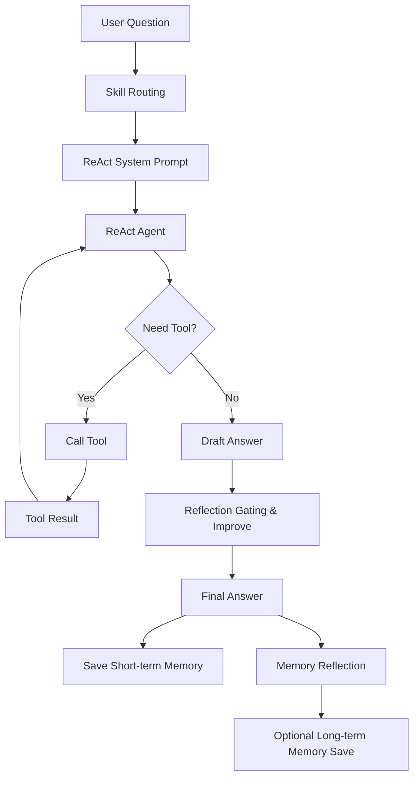
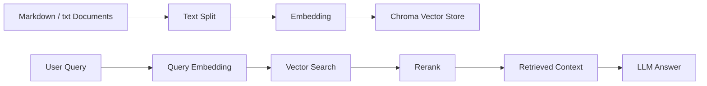

# EduPilot Agent

一个面向个性化学习场景的 AI Agent 项目，集成 **LangGraph 多节点学习工作流**、**ReAct Tool Calling Agent**、**RAG 知识库检索**、**FastAPI 服务化接口**、**Redis 短期会话记忆**、**长期学习画像记忆**、**Prompt Registry**、**Skill Registry** 和 **Reflection 质量控制机制**。

EduPilot Agent 的目标不是构建一个简单问答机器人，而是构建一个能够围绕学习任务进行规划、检索、讲解、测验、批改、复盘和连续追问的教育智能体系统。

---

## 1. 项目简介

EduPilot Agent 是一个教育方向 AI Agent Demo，主要面向“学生围绕某个学习目标进行系统化学习”的场景。

用户可以输入一个学习目标，例如：

```text
学习 LangGraph 中的短期记忆和长期记忆设计
```

系统可以自动完成：

1. 从本地知识库检索相关资料；
2. 根据用户目标、水平和可用时间生成学习计划；
3. 基于资料进行导师式讲解；
4. 自动生成小测验；
5. 支持学生提交答案并获得批改反馈；
6. 根据学习过程生成复盘总结；
7. 支持 ReAct Agent 通过工具调用进行灵活问答；
8. 支持 Redis 短期会话记忆；
9. 支持长期学习画像召回与写入；
10. 支持 Prompt Registry 与 Skill Registry 进行工程化管理；
11. 支持 Reflection 机制对输出进行质量审查和保真增强。

---

## 2. 项目功能总览

| 功能模块               | 说明                                                                    |
| ------------------ | --------------------------------------------------------------------- |
| LangGraph Workflow | 固定多节点学习流程，包含 Retriever、Planner、Tutor、Quiz、Reviewer、Reflection 等节点     |
| ReAct Agent        | 支持工具调用的灵活问答 Agent，可根据问题自主调用 RAG、记忆、规划、讲解、测验等工具                        |
| RAG 检索             | 基于本地 Markdown / txt 知识库构建向量检索能力                                       |
| Rerank 优化          | 支持 `vector_only`、`lightweight` 等检索模式，提升召回相关性                          |
| Prompt Registry    | 将 Planner、Tutor、QA、Quiz、Reflection、Memory Reflection、ReAct 等提示词统一管理   |
| Skill Registry     | 根据用户输入匹配能力单元，返回 `matched_skills`、`recommended_tools`、`routing_reason` |
| Redis 短期记忆         | 基于 `session_id` 保存最近多轮 ReAct 对话历史                                     |
| 长期记忆               | 使用向量数据库保存用户学习画像、学习进度、偏好、薄弱点等长期信息                                      |
| Memory Reflection  | 自动判断一次学习事件是否值得写入长期记忆                                                  |
| Reflection         | 对 ReAct 回答和 Workflow 节点输出进行质量审查与改进                                    |
| FastAPI            | 将 Agent 能力封装为标准后端接口                                                   |
| Streamlit          | 提供可视化交互界面，调用 FastAPI 完成学习流程                                           |
| Eval Cases         | 提供轻量级测试集，用于回归测试和 ReAct Agent 效果观察                                     |

---

## 3. 整体技术架构

EduPilot Agent 当前采用“双模式 Agent 架构”：

1. **LangGraph Workflow 模式**
   用于稳定、结构化的学习闭环，适合执行固定流程任务。

2. **ReAct Tool Calling 模式**
   用于灵活问答和工具调用，适合开放式追问、调试、记忆召回和组合工具执行。

---

## 4. 双 Agent 模式设计

### 4.1 LangGraph Workflow 模式

Workflow 模式是 EduPilot Agent 的稳定主流程，采用多节点分工方式，将完整学习过程拆分为多个可控节点。

典型流程如下：


各节点职责如下：

| 节点         | 功能                            |
| ---------- | ----------------------------- |
| Retriever  | 从本地知识库检索与学习目标相关的资料            |
| Planner    | 根据学习目标、用户水平、可用时间和检索资料生成学习计划   |
| Tutor      | 基于学习计划和资料进行导师式讲解              |
| Quiz       | 根据学习目标和导师讲解生成小测验              |
| Reviewer   | 对本轮学习进行复盘、总结掌握情况和薄弱点          |
| Reflection | 对节点输出或整体 workflow 输出进行质量审查和改进 |

Workflow 模式适合：

* 系统化学习任务；
* 固定学习闭环；
* 需要稳定输出结构的场景；
* 展示多 Agent 分工协作能力；
* 展示 LangGraph State、Node、Edge 的工程化应用。

---

### 4.2 ReAct Tool Calling 模式

ReAct 模式用于更灵活的开放式问答。它不是固定执行所有节点，而是由大模型根据当前问题，自主决定调用哪些工具。

典型流程如下：



ReAct Agent 当前可调用的工具包括：

| 工具                         | 功能                           |
| -------------------------- | ---------------------------- |
| `rag_tool`                 | 从本地知识库检索相关学习资料               |
| `get_current_context_tool` | 获取当前学习上下文，包括学习计划、讲解、测验、历史对话等 |
| `plan_tool`                | 根据目标生成学习计划                   |
| `tutor_tool`               | 对某个主题进行导师式讲解                 |
| `quiz_tool`                | 根据学习内容生成小测验                  |
| `grade_quiz_answer_tool`   | 批改学生答案                       |
| `qa_tool`                  | 基于当前上下文回答学生追问                |
| `review_tool`              | 生成学习复盘与验收建议                  |
| `long_term_memory_tool`    | 召回用户长期学习画像和历史学习进度            |

ReAct 模式适合：

* 学生追问；
* 多工具组合调用；
* 记忆召回；
* 对已有 workflow 结果继续提问；
* 展示 tool calling 能力；
* 展示 Agent 推理—行动—观察循环。

---

## 5. 核心模块说明

项目核心代码结构如下：

```text
edupilot-agent/
├── app.py                         # Streamlit 前端入口
├── api_server.py                  # FastAPI 服务入口
├── requirements.txt               # Python 依赖
├── data/
│   └── knowledge/                 # 本地知识库文档
├── eval_cases/
│   └── react_cases.jsonl          # ReAct Agent 测试样例
├── scripts/
│   └── eval_react_chat.py         # 批量测试脚本
└── src/
    ├── graph.py                   # LangGraph Workflow 主流程
    ├── retriever.py               # RAG 检索与 rerank
    ├── prompts.py                 # Prompt Registry
    ├── skills.py                  # Skill Registry
    ├── react_agent.py             # ReAct Tool Calling Agent
    ├── tools.py                   # ReAct 工具集合
    ├── planner.py                 # 学习计划生成
    ├── tutor.py                   # 导师讲解
    ├── quiz.py                    # 测验生成与批改
    ├── qa.py                      # 追问答疑
    ├── reviewer.py                # 学习复盘
    ├── reflection.py              # Reflection 与保真增强
    ├── memory_reflection.py       # 长期记忆写入判断
    ├── long_term_memory.py        # 长期记忆管理
    ├── vector_memory.py           # 向量记忆基础能力
    ├── redis_memory.py            # Redis 短期会话记忆
    ├── short_term_memory.py       # 短期记忆格式化辅助
    ├── history.py                 # 历史对话管理
    └── llm.py                     # LLM 初始化
```

---

## 6. FastAPI 接口说明

EduPilot Agent 已经从单体 Streamlit Demo 升级为 FastAPI 服务化架构。

### 6.1 健康检查

```http
GET /health
```

用于检查后端服务是否正常运行。

---

### 6.2 运行完整 Workflow

```http
POST /workflow/run
```

输入学习目标、用户水平、学习时间、检索参数等，运行完整 LangGraph 学习工作流。

典型返回内容：

```json
{
  "session_id": "day13-workflow-test",
  "result": {
    "goal": "...",
    "retrieved_context": "...",
    "learning_plan": "...",
    "tutor_explanation": "...",
    "quiz": "...",
    "review": "...",
    "workflow_draft_answer": "...",
    "final_answer": "..."
  }
}
```

---

### 6.3 ReAct Agent 对话

```http
POST /react/chat
```

用于开放式追问和工具调用。

典型返回内容：

```json
{
  "session_id": "day13-test-skill",
  "final_answer": "...",
  "draft_answer": "...",
  "reflection": "...",
  "used_reflection": true,
  "trace": [],
  "matched_skills": [],
  "recommended_tools": [],
  "routing_reason": "...",
  "skill_route": {},
  "redis_memory": {},
  "long_term_memory_result": {}
}
```

其中：

| 字段                        | 说明               |
| ------------------------- | ---------------- |
| `final_answer`            | 最终回答             |
| `draft_answer`            | ReAct Agent 原始回答 |
| `reflection`              | 反思审查结果           |
| `used_reflection`         | 是否启用 Reflection  |
| `trace`                   | 工具调用轨迹           |
| `matched_skills`          | 命中的 Skill        |
| `recommended_tools`       | Skill 推荐优先考虑的工具  |
| `routing_reason`          | Skill 路由原因       |
| `redis_memory`            | Redis 短期记忆保存结果   |
| `long_term_memory_result` | 长期记忆写入结果         |

---

### 6.4 追问答疑

```http
POST /qa/followup
```

用于根据当前学习上下文回答学生追问。

---

### 6.5 测验批改

```http
POST /quiz/grade
```

用于批改学生对小测验的回答，返回反馈和改进建议。

---

### 6.6 查看 Redis 会话历史

```http
GET /memory/history?session_id=<session_id>
```

用于查看指定 session 的 ReAct Agent 对话历史。

---

### 6.7 清空 Redis 会话历史

```http
DELETE /memory/clear?session_id=<session_id>
```

用于清空指定 session 的短期会话记忆。

---

## 7. Streamlit 前端说明

Streamlit 前端用于提供可视化交互界面。当前前端已经改造为调用 FastAPI 后端接口，而不是直接在前端执行全部逻辑。

前端主要能力包括：

1. 输入学习目标；
2. 配置学习水平、学习时间、RAG 参数；
3. 调用 `/workflow/run` 执行完整学习流程；
4. 调用 `/react/chat` 进行 ReAct Agent 问答；
5. 展示工具调用 trace；
6. 展示 Skill 路由结果；
7. 查看 Redis 记忆；
8. 清空 Redis 记忆；
9. 展示学习计划、导师讲解、测验、复盘、Reflection 等结果。

这种设计使项目从本地 Demo 逐步向“前后端解耦”的服务化架构过渡。

---

## 8. RAG 与 Rerank 机制

EduPilot Agent 支持本地知识库检索增强生成。

### 8.1 知识库流程



### 8.2 检索模式

当前支持多种检索模式：

| 模式             | 说明                      |
| -------------- | ----------------------- |
| `vector_only`  | 仅使用向量相似度检索              |
| `lightweight`  | 向量召回后结合关键词分数进行轻量 rerank |
| `model_rerank` | 预留模型级 rerank 模式，用于后续扩展  |

### 8.3 Embedding 缓存优化

`retriever.py` 已加入 embedding 初始化缓存，避免在 API 多次调用时反复加载 embedding 模型，减少重复开销，提高后端响应稳定性。

---

## 9. Prompt Engineering 2.0

EduPilot Agent 将提示词统一迁移到 `src/prompts.py` 中，构建 Prompt Registry。

### 9.1 Prompt Registry 设计目标

Prompt Registry 的目标是：

1. 避免 prompt 散落在各个业务函数中；
2. 支持 prompt 名称、版本、描述和变量管理；
3. 便于统一调试和迭代；
4. 支持 system message 和 human message 分离；
5. 便于向面试官展示 Prompt Engineering 工程化能力。

### 9.2 当前纳入 Registry 的 Prompt

当前已纳入 Prompt Registry 的模块包括：

| Prompt                              | 用途                            |
| ----------------------------------- | ----------------------------- |
| `planner`                           | 学习计划生成                        |
| `tutor`                             | 导师讲解                          |
| `quiz`                              | 小测验生成                         |
| `grade`                             | 答案批改                          |
| `qa`                                | 追问答疑                          |
| `reviewer`                          | 学习复盘                          |
| `react_system`                      | ReAct Agent 系统提示词             |
| `react_reflection_system`           | ReAct Reflection 系统提示         |
| `react_reflection_human`            | ReAct Reflection 用户上下文提示      |
| `react_improve_system`              | ReAct 改写系统提示                  |
| `react_improve_human`               | ReAct 改写上下文提示                 |
| `workflow_node_reflection_system`   | Workflow 节点级 Reflection 系统提示  |
| `workflow_node_reflection_human`    | Workflow 节点级 Reflection 上下文提示 |
| `workflow_global_reflection_system` | Workflow 全局 Reflection 系统提示   |
| `workflow_global_reflection_human`  | Workflow 全局 Reflection 上下文提示  |
| `memory_reflection_system`          | 长期记忆判断系统提示                    |
| `memory_reflection_human`           | 长期记忆判断上下文提示                   |

### 9.3 System Message / Human Message 分离

当前 Prompt 设计尽量将两类信息分离：

| 类型             | 作用                                 |
| -------------- | ---------------------------------- |
| System Message | 定义角色、任务边界、输出原则、安全约束                |
| Human Message  | 注入本轮具体变量，例如问题、学习目标、检索资料、历史记忆、草稿回答等 |

这种方式使 prompt 更清晰，也更接近真实生产项目中的 LLM 应用开发方式。

---

## 10. Skill Registry 2.0

Skill Registry 用于对用户输入进行轻量能力识别。

当前 Skill 不是硬路由，不会强制限制工具调用，而是作为 ReAct Agent 的“软提示”和“调试展示”。

### 10.1 Skill Route 返回字段

`analyze_skill_route()` 会返回：

```json
{
  "matched_skills": [],
  "matched_skill_display_names": [],
  "recommended_tools": [],
  "routing_reason": "",
  "skill_cards": []
}
```

字段说明：

| 字段                            | 说明                             |
| ----------------------------- | ------------------------------ |
| `matched_skills`              | 当前问题命中的 Skill 名称               |
| `matched_skill_display_names` | Skill 中文展示名                    |
| `recommended_tools`           | 当前问题综合推荐优先考虑的工具                |
| `routing_reason`              | 命中原因，例如命中了哪些关键词                |
| `skill_cards`                 | 每个 Skill 的详细说明、关联 prompt 和关联工具 |

### 10.2 related_tools 与 recommended_tools

| 字段                  | 含义                           |
| ------------------- | ---------------------------- |
| `related_tools`     | 某个 Skill 静态绑定的相关工具           |
| `recommended_tools` | 当前用户问题命中的多个 Skill 汇总后的推荐工具列表 |

例如：

```text
rag_tutor.related_tools = ["rag_tool", "tutor_tool"]
followup_qa.related_tools = ["qa_tool"]
memory_personalization.related_tools = ["long_term_memory_tool"]
```

如果一个问题同时命中这三个 Skill，则：

```text
recommended_tools = ["rag_tool", "tutor_tool", "qa_tool", "long_term_memory_tool"]
```

### 10.3 当前 Skill 类型

| Skill                    | 说明            | 推荐工具                     |
| ------------------------ | ------------- | ------------------------ |
| `learning_planner`       | 个性化学习规划       | `plan_tool`              |
| `rag_tutor`              | RAG 导师讲解      | `rag_tool`, `tutor_tool` |
| `quiz_generation`        | 小测验生成         | `quiz_tool`              |
| `quiz_grading`           | 答案批改          | `grade_quiz_answer_tool` |
| `followup_qa`            | 追问答疑          | `qa_tool`                |
| `reflection_review`      | 回答质量审查        | Reflection 后处理           |
| `memory_personalization` | 长期记忆个性化       | `long_term_memory_tool`  |
| `retrieval_debug`        | 检索与 rerank 调试 | `rag_tool`               |

---

## 11. Memory 机制

EduPilot Agent 当前包含两类记忆机制：

1. Redis 短期会话记忆；
2. 向量数据库长期学习画像记忆。

---

### 11.1 Redis 短期会话记忆

Redis 短期记忆用于保存同一 `session_id` 下最近 N 轮 ReAct Agent 对话。

主要特点：

1. 基于 `session_id` 隔离不同会话；
2. 保存用户问题、Agent 回答、工具 trace 等内容；
3. 支持查看和清空；
4. 适合 API 化、多端调用和服务端统一管理；
5. 不依赖 Streamlit session state。

典型 Redis key：

```text
edupilot:session:<session_id>:react
```

需要注意的是，当前项目中的 Redis 短期记忆主要是 **FastAPI 层面的会话历史缓存**。它和 LangGraph 原生的 `RedisSaver Checkpointer` 是不同层次的机制。

后续可以进一步将 LangGraph Workflow 的 checkpointer 从内存型实现升级为 RedisSaver，实现更完整的图状态持久化。

---

### 11.2 长期学习画像记忆

长期记忆用于保存跨会话、跨日期仍然有价值的信息，例如：

1. 学生学习目标；
2. 当前项目进度；
3. 已掌握知识点；
4. 薄弱环节；
5. 学习偏好；
6. 后续计划；
7. 关键技术概念理解状态。

长期记忆通过向量数据库存储，可以根据当前问题进行语义召回，并注入 Agent 上下文。

---

### 11.3 Memory Reflection

Memory Reflection 用于判断一次学习事件是否值得写入长期记忆。

它不会把所有对话都保存下来，而是通过 LLM 判断：

1. 是否包含稳定学习进度；
2. 是否包含用户偏好；
3. 是否包含长期目标；
4. 是否包含明显薄弱点；
5. 是否包含后续可复用的项目状态。

这样可以避免长期记忆中充满无意义对话，提升长期记忆质量。

---

## 12. Reflection 质量控制机制

EduPilot Agent 当前包含两类 Reflection：

1. ReAct Agent 最终回答 Reflection；
2. Workflow 节点级和全局 Reflection。

---

### 12.1 ReAct Reflection

ReAct Agent 的回答流程如下：

```text
draft_answer
→ reflect_answer()
→ 判断是否需要改写
→ improve_answer()
→ final_answer
```

为了解决早期出现的“Reflection 后 final answer 过短、信息丢失”的问题，当前加入了 Reflection Gating：

```text
如果草稿质量较高，或模型判断“不需要改写”，则直接保留 draft_answer；
只有当发现明显问题时，才进入 improve_answer。
```

同时，改写 prompt 被调整为“保真增强”策略：

1. 保留草稿中正确、有用的内容；
2. 不删除关键步骤、代码、工具结果和注意事项；
3. 如果只是轻微问题，只做局部修补；
4. 尽量保留原有结构；
5. 避免把完整回答改写成过短摘要。

---

### 12.2 Workflow 节点级 Reflection

Workflow 中的 Tutor、Quiz、Reviewer 等节点支持节点级 Reflection。

节点输出流程如下：

```text
node_draft_output
→ reflect_node_output()
→ improved_output
→ 写回 State
```

例如 Quiz 节点中，最终返回的是：

```python
quiz_reflection["improved_output"]
```

这意味着节点级 Reflection 不只是审查意见，而是可以直接参与最终节点输出。

---

### 12.3 Workflow 全局 Reflection

Workflow 完成后，可以将学习计划、导师讲解、小测验、复盘等内容组合成完整学习方案，再进行全局审查和保真增强。

全局 Reflection 用于检查：

1. 是否符合用户学习目标；
2. 是否充分利用检索资料；
3. 是否适合用户水平；
4. 是否存在内容遗漏；
5. 是否有明显逻辑问题；
6. 是否需要轻微优化表达。

---

## 13. 测试集与回归测试

项目包含轻量级 ReAct Agent 测试集：

```text
eval_cases/react_cases.jsonl
scripts/eval_react_chat.py
```

### 13.1 测试集用途

`eval_cases` 不是训练集，也不是严格 benchmark，而是项目自测用例，用于：

1. 验证 `/react/chat` 是否正常；
2. 验证工具调用是否合理；
3. 验证 Skill 命中是否符合预期；
4. 验证 Redis 短期记忆是否有效；
5. 验证长期记忆是否能召回；
6. 验证 Reflection 是否过度压缩；
7. 在每次修改代码后进行回归测试。

---

### 13.2 运行测试集

启动 FastAPI 后运行：

```bash
python scripts/eval_react_chat.py --enable-reflection
```

测试结果会写入：

```text
eval_results/
```

建议将 `eval_results/` 加入 `.gitignore`，避免提交大量临时测试结果。

---

### 13.3 手动回归测试命令

#### 健康检查

```bash
curl http://127.0.0.1:8000/health
```

#### 测试 ReAct Chat

```bash
curl -s -X POST http://127.0.0.1:8000/react/chat \
  -H "Content-Type: application/json" \
  -d '{
    "session_id": "day13-test-skill",
    "question": "我不懂 Redis 短期记忆和 LangGraph InMemorySaver 有什么区别，请结合项目讲清楚。",
    "goal": "Build an AI Agent project in 10 days.",
    "level": "Beginner",
    "hours": 4,
    "enable_reflection": true,
    "rag_top_k": 3,
    "rag_fetch_k": 8,
    "retrieval_mode": "lightweight",
    "max_memory_rounds": 10
  }' | python -m json.tool
```

#### 测试 Redis 短期记忆

第一轮：

```bash
curl -X POST http://127.0.0.1:8000/react/chat \
  -H "Content-Type: application/json" \
  -d '{
    "session_id": "day13-memory-test",
    "question": "我今天在做 Prompt Engineering 2.0。",
    "enable_reflection": false
  }'
```

第二轮：

```bash
curl -X POST http://127.0.0.1:8000/react/chat \
  -H "Content-Type: application/json" \
  -d '{
    "session_id": "day13-memory-test",
    "question": "你还记得我刚才说今天在做什么吗？",
    "enable_reflection": false
  }'
```

查看历史：

```bash
curl "http://127.0.0.1:8000/memory/history?session_id=day13-memory-test" | python -m json.tool
```

清空历史：

```bash
curl -X DELETE "http://127.0.0.1:8000/memory/clear?session_id=day13-memory-test"
```

#### 测试完整 Workflow

```bash
curl -s -X POST http://127.0.0.1:8000/workflow/run \
  -H "Content-Type: application/json" \
  -d '{
    "session_id": "day13-workflow-test",
    "goal": "学习 LangGraph 中的短期记忆和长期记忆设计",
    "level": "Beginner",
    "hours": 4,
    "rag_top_k": 3,
    "rag_fetch_k": 8,
    "retrieval_mode": "lightweight",
    "enable_reflection": true
  }' | python -m json.tool
```

---

## 14. 快速启动

### 14.1 创建环境

```bash
conda create -n edupilot python=3.10
conda activate edupilot
pip install -r requirements.txt
```

---

### 14.2 配置环境变量

根据 `src/llm.py` 中的实际 LLM 配置，设置对应 API Key。

示例：

```bash
export DEEPSEEK_API_KEY="your_api_key"
```

如使用 `.env` 文件，可自行添加：

```text
DEEPSEEK_API_KEY=your_api_key
REDIS_URL=redis://localhost:6379/0
```

---

### 14.3 启动 Redis

```bash
redis-server
```

---

### 14.4 启动 FastAPI

```bash
uvicorn api_server:app --reload
```

默认服务地址：

```text
http://127.0.0.1:8000
```

---

### 14.5 启动 Streamlit

```bash
streamlit run app.py
```

---

### 14.6 运行语法检查

```bash
python -m compileall api_server.py app.py src
```

---

## 15. 项目亮点

### 15.1 双 Agent 架构

项目同时包含：

1. 固定多节点 LangGraph Workflow；
2. 灵活 ReAct Tool Calling Agent。

前者适合稳定学习闭环，后者适合工具调用和开放追问。

---

### 15.2 从 Demo 到服务化架构

项目从 Streamlit 单体 Demo 升级到 FastAPI 后端服务，支持标准 API 调用，并将 Streamlit 改造为前端调用层。

---

### 15.3 多层记忆机制

项目同时支持：

1. Redis 短期会话记忆；
2. 向量数据库长期学习画像；
3. Memory Reflection 自动筛选值得保存的信息。

---

### 15.4 Prompt 工程化管理

通过 Prompt Registry 统一管理不同模块提示词，并将 Reflection、Memory Reflection、ReAct Agent 等复杂 prompt 纳入统一管理。

---

### 15.5 Skill 可解释路由

Skill Registry 不强制控制工具调用，而是作为轻量可解释路由层，输出命中技能、推荐工具和路由原因，使 ReAct Agent 的行为更容易调试和展示。

---

### 15.6 Reflection 保真增强

Reflection 不是简单重写，而是通过 gating 和保真增强原则，避免 final answer 被过度压缩，提升回答质量和稳定性。

---

### 15.7 可测试性

通过 `eval_cases` 和批量测试脚本，项目具备轻量级回归测试能力，方便每次修改后验证核心功能是否被破坏。

---

## 16. 后续优化方向

后续可以继续扩展以下方向：

1. 将当前 Redis 会话缓存进一步升级为 LangGraph 原生 RedisSaver Checkpointer；
2. 增加更严格的自动评分指标，对 ReAct Agent 输出进行量化评估；
3. 接入真实模型 reranker，提高 RAG 检索排序质量；
4. 将 Skill Registry 从软提示升级为可选硬路由策略；
5. 增加多用户权限和用户画像管理；
6. 支持更多知识库格式，例如 PDF、Word、网页链接等；
7. 将长期记忆进行分层管理，例如偏好、掌握点、薄弱点、项目进度分库保存；
8. 增加 Docker 部署脚本；
9. 优化 Streamlit 页面布局，使其更适合面试 Demo 展示；
10. 将 API 文档整理为 Swagger 使用说明和 Postman 示例。

---

## 17. 项目总结

EduPilot Agent 是一个围绕教育学习场景构建的完整 AI Agent 项目。它不仅实现了基础的大模型问答，还进一步融合了：

* LangGraph 多节点工作流；
* ReAct Tool Calling；
* RAG 检索增强；
* Redis 短期记忆；
* 长期学习画像；
* Prompt Registry；
* Skill Registry；
* Reflection 质量控制；
* FastAPI 服务化；
* Streamlit 可视化界面；
* eval_cases 回归测试。

该项目体现了 AI Agent 应用从“单轮问答”到“可规划、可调用工具、可记忆、可反思、可测试、可服务化”的完整工程演进过程。
